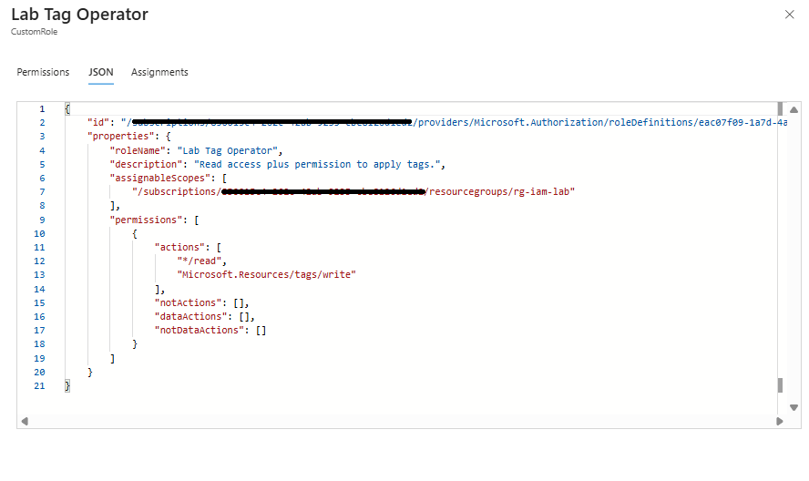
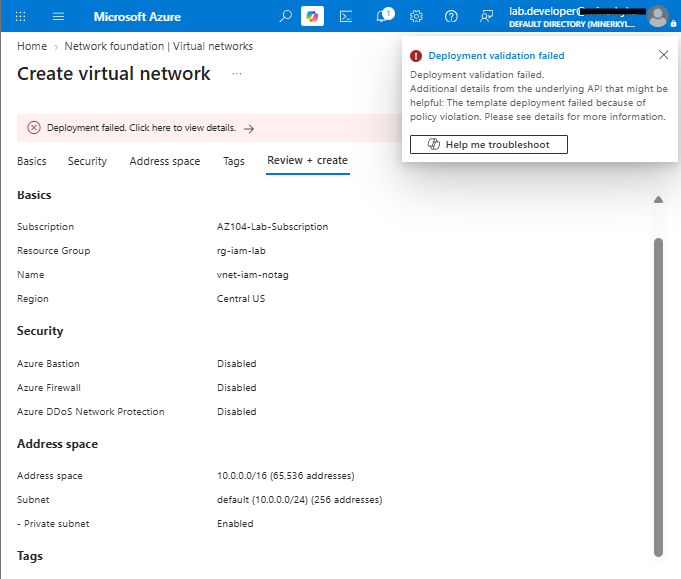
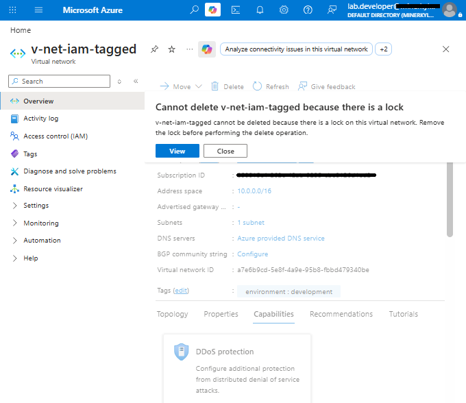

# Azure Identity & Governance for a Healthcare Application

## Overview

This project simulates an Azure identity and governance deployment for **Contoso Health Services**, a fictional healthcare organization building a patient-services application.

The goal was to create a small, controlled Azure environment that demonstrates the core governance tasks expected of an Azure administrator:

- Group-based Azure RBAC
- Least-privilege access
- Custom role design
- Azure Policy enforcement
- Resource locks
- Permission testing
- Bicep infrastructure as code
- Azure CLI validation
- Cleanup and verification

Rather than only configuring resources in the portal, I tested whether the permissions and controls behaved as intended.

---

## Architecture

```text
Microsoft Entra ID
│
├── Lab Developer
│   └── grp-lab-developers
│       └── Contributor
│
└── Lab Auditor
    └── grp-lab-compliance
        ├── Reader
        └── Lab Tag Operator

Azure Subscription
│
├── rg-iam-lab
│   ├── Azure Policy
│   ├── CanNotDelete lock
│   └── Test virtual networks
│
└── rg-iam-lab-iac
    └── Same governance configuration rebuilt with Bicep
```

**Region:** Central US

---

## 1. Group-Based RBAC

Access was assigned to **security groups instead of directly to users**.

| Principal | Access |
|---|---|
| `grp-lab-developers` | Contributor |
| `grp-lab-compliance` | Reader |
| `lab.developer` | Contributor through group membership |
| `lab.auditor` | Reader through group membership |


The developer successfully deployed a resource, confirming that Contributor permissions were effective.


The auditor could view resources but a write attempt was denied, confirming the intended Reader boundary.


<details>
<summary><strong>Additional RBAC evidence</strong></summary>


</details>

---

## 2. Least-Privilege Custom Role

Reader access was intentionally too limited for the auditor to modify tags.

To solve that without granting Contributor, I created a custom role named **Lab Tag Operator** with:

```text
*/read
Microsoft.Resources/tags/write
```



After assigning the custom role to the compliance group, the auditor could modify tags while retaining Reader for general resource access.


This demonstrates a common governance pattern: **add only the missing permission instead of broadening access unnecessarily**.

<details>
<summary><strong>Role assignment evidence</strong></summary>


</details>

---

## 3. Azure Policy

A built-in Azure Policy was assigned to require an **Environment** tag on resources.


A deployment without the required tag was denied.



This demonstrates the difference between two Azure governance controls:

- **RBAC:** Who is allowed to perform an action?
- **Azure Policy:** Is the requested configuration allowed?

A user can have sufficient RBAC permissions and still have a deployment denied by Policy.

The resource group itself remained untagged because **Require a tag on resources** applies to resources inside the group, not the resource group itself.

---

## 4. Resource Protection with Locks

A `CanNotDelete` lock named `prevent-rg-deletion` was applied to the lab resource group.


A deletion attempt against a protected resource was blocked.



This demonstrates that Azure resource locks provide a protection layer beyond normal RBAC permissions.

<details>
<summary><strong>Activity Log evidence</strong></summary>


</details>

---

## 5. Rebuilding the Environment with Bicep

After completing the configuration manually, I rebuilt the governance environment in `rg-iam-lab-iac` using **Bicep**.

The deployment recreated the intended:

- Contributor role assignment
- Reader role assignment
- Lab Tag Operator assignment
- Azure Policy assignment
- `CanNotDelete` lock

Azure CLI was used to verify the deployed configuration.


The Bicep deployment was then run again using **Incremental mode**.


The repeat deployment succeeded without creating duplicate role assignments.

This demonstrates the transition from manual administration to **repeatable infrastructure as code**.

---

## Validation Summary

| Test | Result |
|---|---|
| Developer inherits Contributor through group | Passed |
| Developer can deploy resources | Passed |
| Auditor can read resources | Passed |
| Auditor write attempt is denied | Passed |
| Custom role adds tag-write capability | Passed |
| Policy blocks untagged resource deployment | Passed |
| Delete lock blocks deletion | Passed |
| Bicep recreates governance configuration | Passed |
| Incremental redeployment succeeds | Passed |
| Lab resources cleaned up | Passed |

---

## Key Lessons

**RBAC and Policy solve different problems.**  
RBAC controls authorization. Policy controls whether a configuration is allowed.

**Least privilege is more precise than broad access.**  
A custom role supplied the specific tag permission Reader lacked without granting Contributor.

**Locks can interrupt legitimate administrative actions.**  
Even an authorized user cannot delete a protected resource until the lock is removed.

**Infrastructure as code improves repeatability.**  
The same governance configuration can be rebuilt and validated through Bicep rather than recreated manually in the portal.

---

## Scope and Limitations

This project intentionally stays within a small lab scope:

- One Azure subscription
- Two test users
- One primary Azure region
- Resource-group-level governance

It does not implement:

- Conditional Access
- Privileged Identity Management
- Cross-tenant administration
- Management-group governance
- Enterprise-scale landing zones

The Bicep deployment used **Incremental mode**, so resources not declared in the template are not automatically removed.

---

## Cleanup

After validation, the lab resource groups and resources were removed.


Custom role definitions were deleted separately because role definitions can exist independently of the resource groups where they are assigned.

---

## Repository Structure

```text
.
├── README.md
├── bicep/
│   └── main.bicep
└── screenshots/
    └── validation screenshots
```
