# Azure Identity & Governance Lab

Hands-on lab covering the core identity and governance tasks of an Azure cloud admin: group-based RBAC, a custom role, Azure Policy, resource locks, and rebuilding the same configuration with Bicep.

## Goal and architecture

Two test users get access only through security groups, never by direct assignment. Everything is scoped to a single resource group (`rg-iam-lab`), so the blast radius is small and cleanup is a single delete. A custom role grants tagging rights without broader write access, a policy enforces tagging, and a lock protects the group from deletion. The whole setup is then rebuilt as code in `rg-iam-lab-iac`.

| Principal | Type | Role | Scope |
|---|---|---|---|
| `lab.developer` | User, member of group | Contributor (via group) | `rg-iam-lab` |
| `grp-lab-developers` | Security group | Contributor | `rg-iam-lab` |
| `lab.auditor` | User, member of group | Reader (via group) | `rg-iam-lab` |
| `grp-lab-compliance` | Security group | Reader | `rg-iam-lab` |
| Lab Tag Operator | Custom role | Tag write only | `rg-iam-lab` |
| Lab Tag Operator (IaC) | Custom role (Bicep) | Same, defined as code | `rg-iam-lab-iac` |

**Region:** Central US (East US restricted VM SKUs on this subscription).

## Tests

### 1. Group membership and RBAC

Access comes from group membership, not direct user assignments.


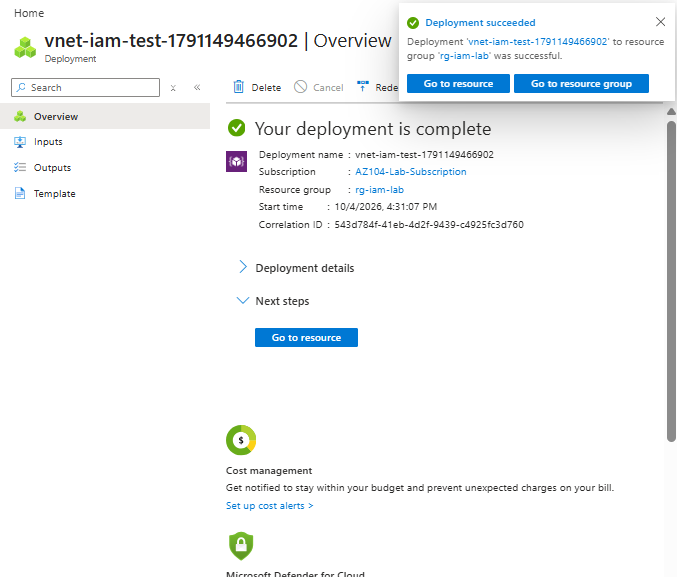
`lab.developer` inherits Contributor from the group and can deploy resources.


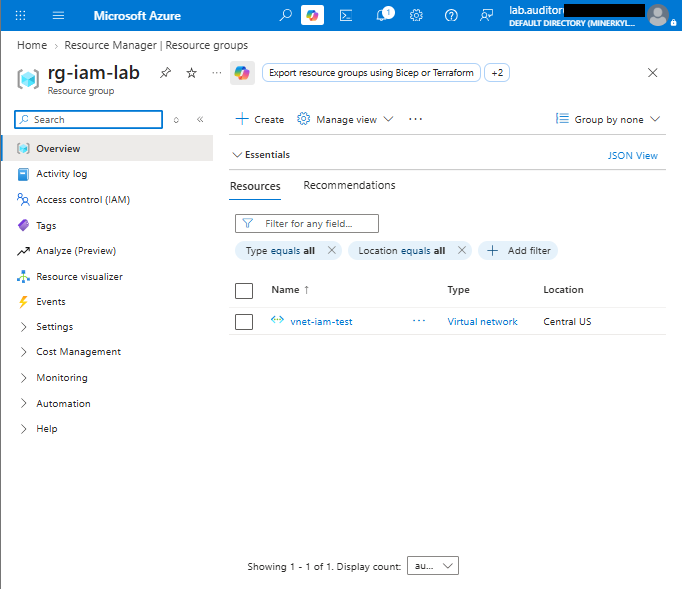
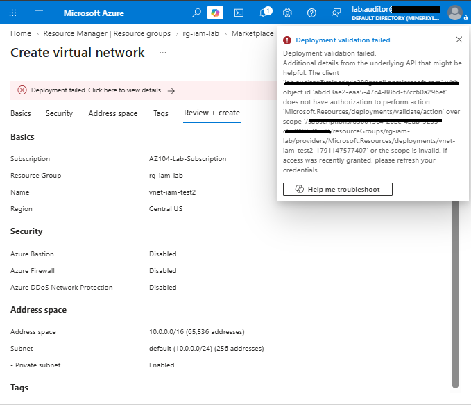
`lab.auditor` can read resources but a write attempt is denied. Reader works as intended.

### 2. Custom role
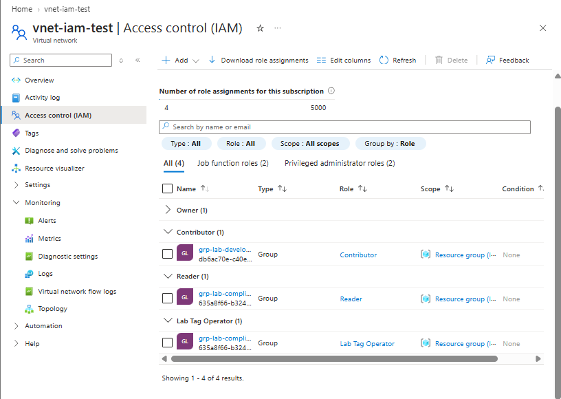
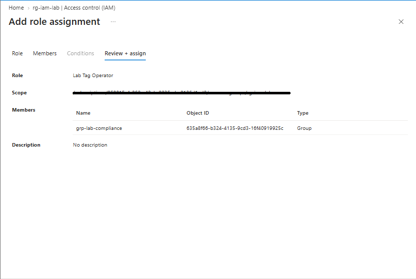
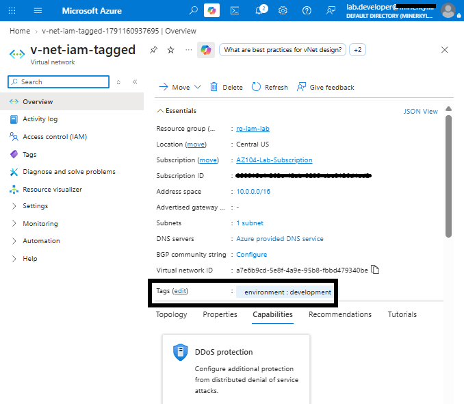
A user holding only Lab Tag Operator can apply tags, which a plain Reader cannot.

### 3. Azure Policy (tag requirement)
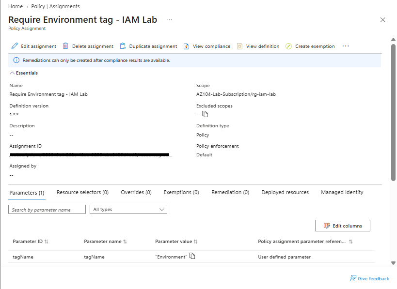

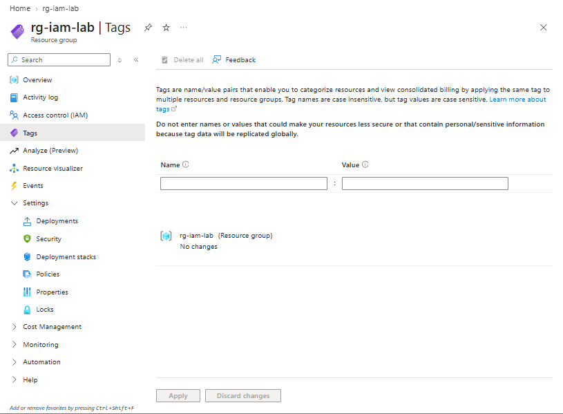
The assigned policy blocks creation of a resource that lacks the required tag.

### 4. Resource lock
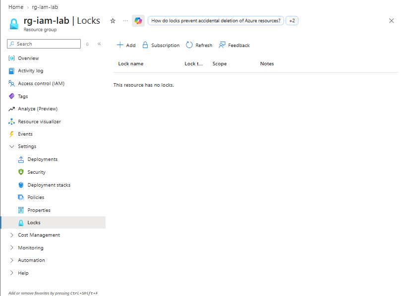
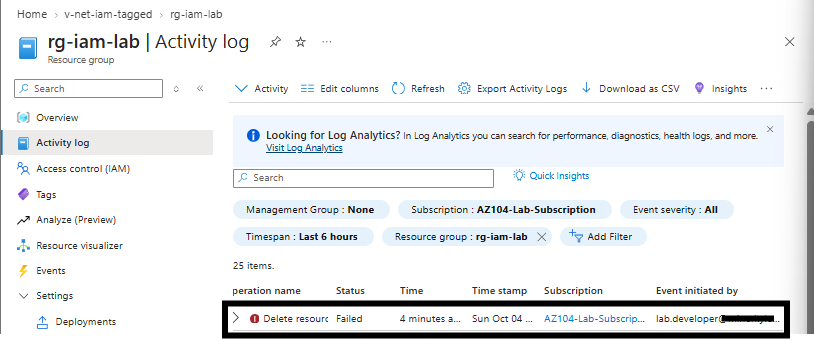
A delete lock on the resource group blocks deletion and the attempt shows in the activity log.

### 5. Bicep rebuild
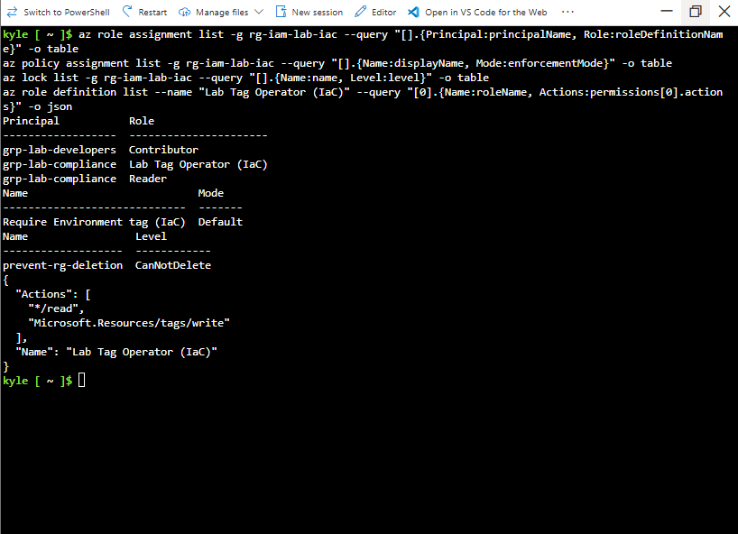
The same roles, policy and lock were deployed from Bicep into `rg-iam-lab-iac` and checked against the portal.

## What this does and doesn't prove

- **Proves:** group-based RBAC behaves as designed for Contributor and Reader; the custom role grants only what it should; the policy denies untagged resources; the lock blocks deletion.
- **Doesn't prove:** the Bicep policy test ran as my owner account, not as `lab.developer`, so it doesn't show how the policy behaves for a least-privilege user through IaC.
- **Doesn't prove:** the Bicep deployment used Incremental mode. A clean re-run shows no duplicates, but that is not drift correction. Manual changes made outside Bicep would not have been reverted.
- Single subscription, two test users, one region. No Conditional Access, PIM or cross-tenant scenarios.

## Cleanup verified


Both lab resource groups and their contents are gone; only `NetworkWatcherRG` remains. Custom roles were deleted separately, since role definitions can outlive the groups.

## Repo layout

```text
.
├── README.md
├── bicep/
└── screenshots/
```
